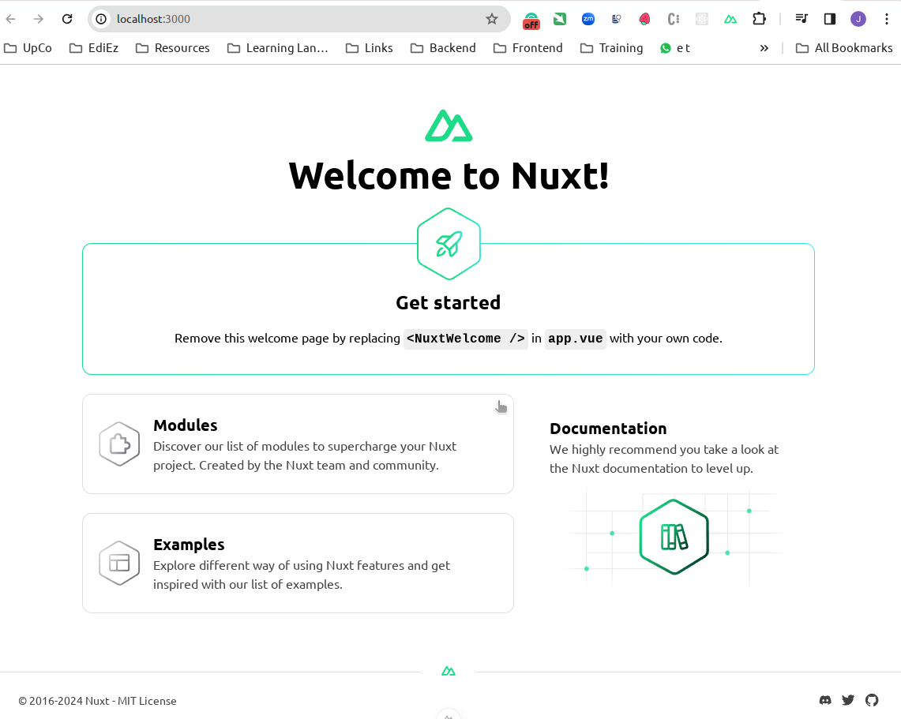
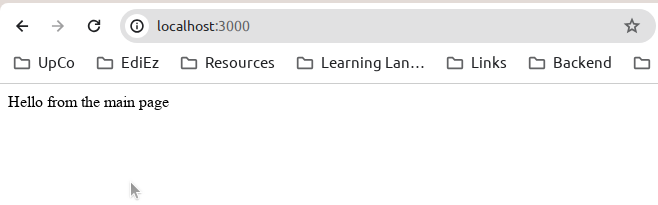
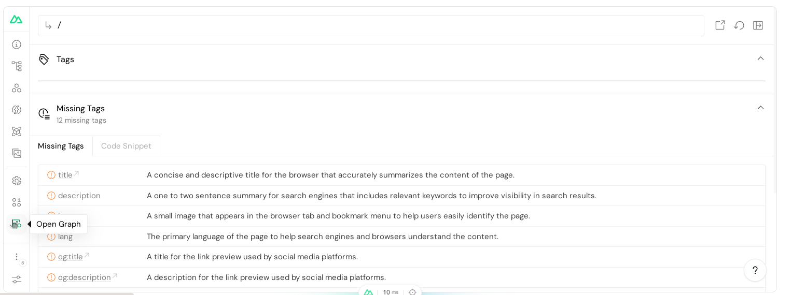
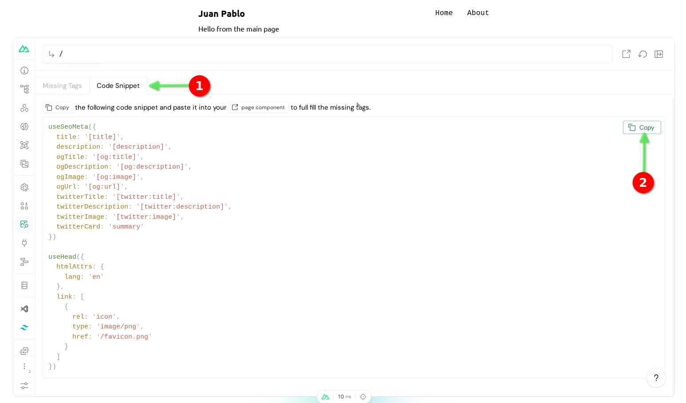
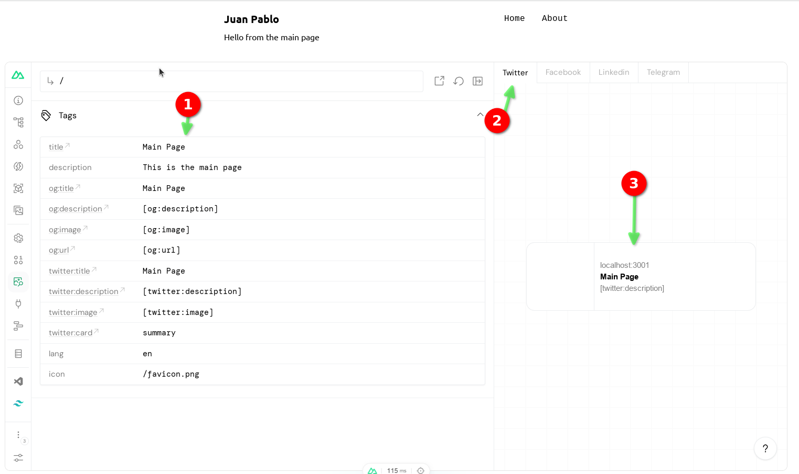
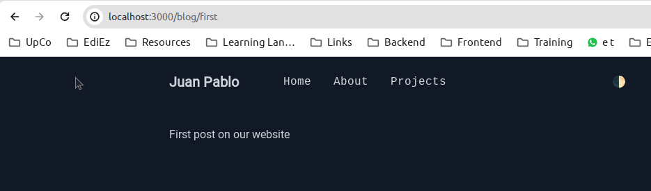
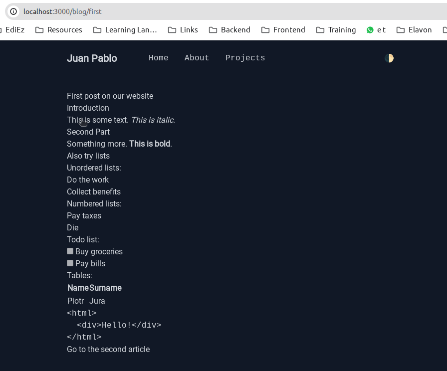
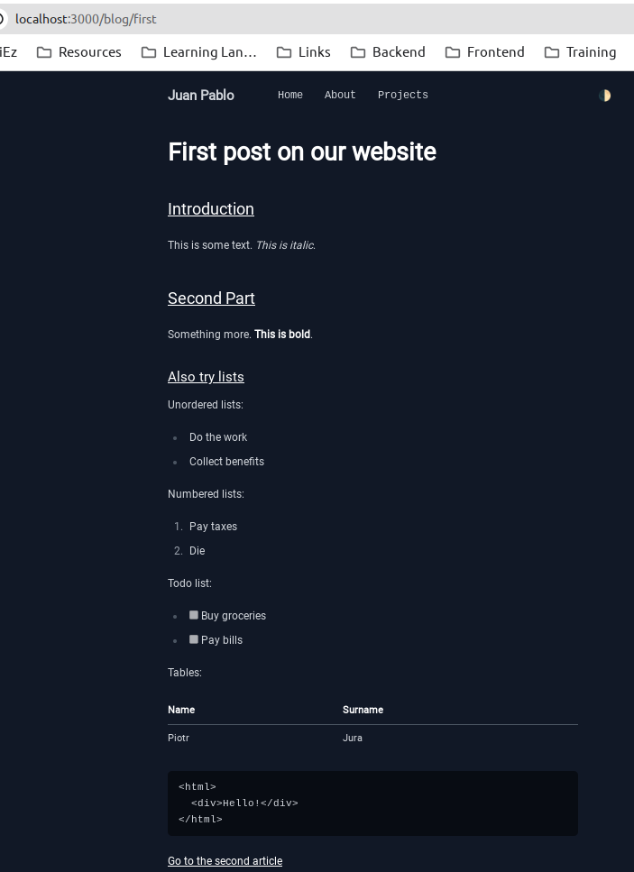
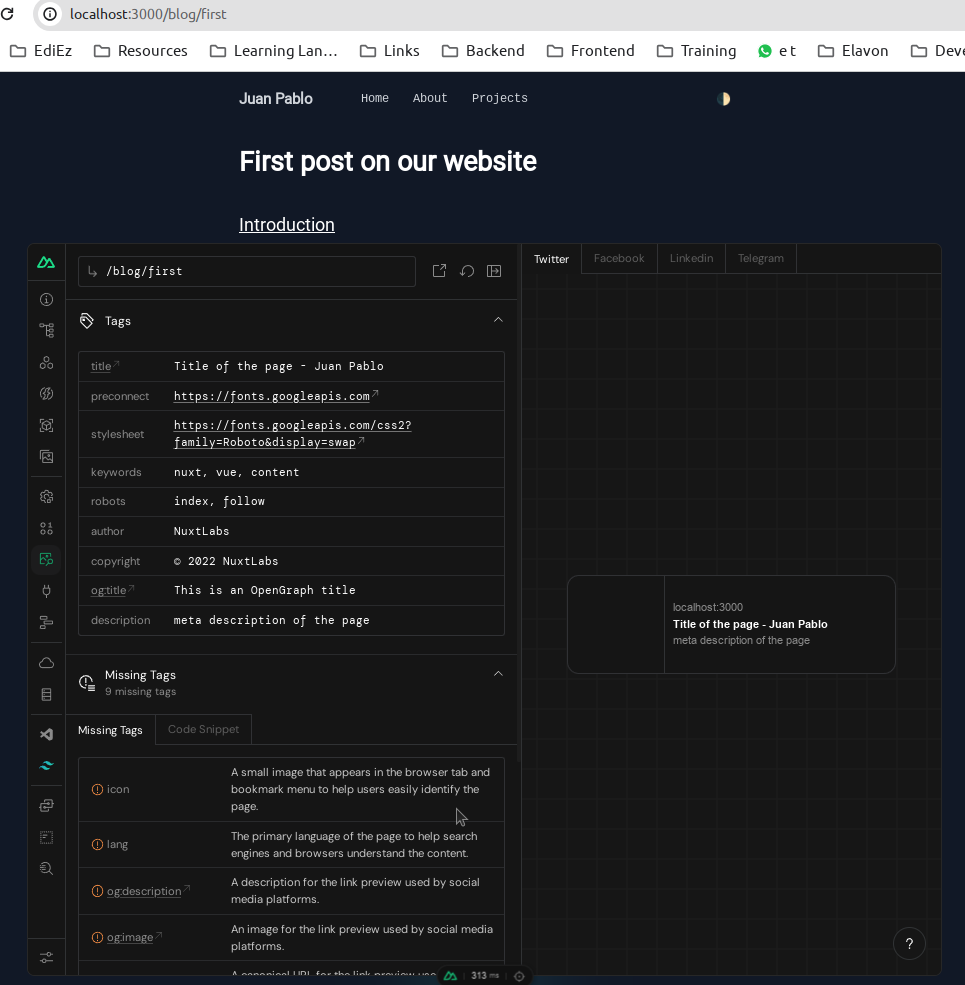

# Master Nuxt 3 - Full Stack Complete Guide - Porfolio

In this document, we will create a portfolio website using Nuxt 3 based on the [Master Nuxt 3 - Full-Stack Complete Guide
](https://www.udemy.com/course/master-nuxt-full-stack-complete-guide) Udemy Course.

## 1. Create a new project

- We are going to use Bun to proceed with the creation of the project. Bun is a CLI tool that helps you create Nuxt 3 projects.

```bash
bunx nuxi@latest init nuxt3-ts-portfolio
```

- Once it has been created we can run the project with the following command:

```bash
juanpabloperez@jpp-PROX15-AMD:~/Work/Projects/EdiEz/Examples/nuxt3-ts-portfolio$ bun run dev -o
$ nuxt dev -o
Nuxt 3.9.3 with Nitro 2.8.1                                                                                                                      18:30:48
                                                                                                                                                 18:30:49
  ➜ Local:    http://localhost:3000/
  ➜ Network:  use --host to expose

  ➜ DevTools: press Shift + Alt + D in the browser (v1.0.8)                                                                                      18:30:50

ℹ Vite client warmed up in 915ms                                                                                                                18:30:51
ℹ Vite server warmed up in 1045ms                                                                                                               18:30:52
✔ Nitro built in 426 ms   
```

- We can open the browser and go to the following URL: <http://localhost:3000/> to see the project running.



## 2. Adding elements to our project

### 2.1 Creating Pages for our Project

- A we can see on [Pages](https://nuxt.com/docs/getting-started/views#pages), we need to create documents inside the `pages` folder to create pages for our project.

- We also need to modify the main `app.Vue` file to add the `NuxtPage` component to navigate between pages.

> app.vue

```vue
<template>
  <div>
    <NuxtPage />
  </div>
</template>
```

- We can create a `pages/index.vue` file to create the home page of our project.

> pages/index.vue

```vue
<template>
  <div>
    <NuxtPage />
  </div>
</template>
```



- We can add different pages to our project. For example, we can create a `pages/about.vue` file to create the about page of our project.

> pages/about.vue

```vue
<template>
  <div>
    This page is about me.
  </div>
</template>
```

> pages/blog/index.vue

```vue
<template>
  <div>
    All blog posts List!
  </div>
</template>
```

> pages/blog/[id].vue

```vue
<script setup>
const route = useRoute()
</script>

<template>
  <div>
    We are inside a blog!
  </div>
  <div>
    Post id is {{ route.params.id }}
  </div>
</template>
```

### 2.2 Creating Layouts for our Project

- As we can see on [Layouts](https://nuxt.com/docs/guide/directory-structure/layouts), we can create a `layouts/default.vue` file to create a default layout for our project.

> layouts/default.vue

```vue
<template>
  <div>
    <nav>
      <NuxtLink to="/">Home</NuxtLink> |
      <NuxtLink to="/about">About</NuxtLink>
    </nav>
    <slot />
  </div>
</template>
```

- We need to modify the `app.vue` file to use the `default.vue` layout.

> app.vue

```vue
<template>
  <NuxtLayout>
    <NuxtPage />
  </NuxtLayout>
</template>
```

- We can create a `layouts/another.vue` file to create a different layout for some pages.

> layouts/another.vue

```vue
<template>
  <div>
    <div>This is another layout</div>
    <slot />
  </div>
</template>
```

- We can use the `another.vue` layout in the `about.vue` page.

> pages/about.vue

```vue
<script setup>
function enableAnotherLayout () {
  setPageLayout('another')
}
</script>
<template>
  <div>
    This page is about me.
    <button @click="enableAnotherLayout">Update layout</button>
  </div>
</template>
```

### 2.3 Adding a Module to our Project

- As we can see on [Modules](https://nuxt.com/docs/guide/concepts/modules), we can add a module, an specific library, to our project using the `bun add` command.
- In this case, we are going to add the `@nuxt/tailwindcss` module to our project.

```bash
juanpabloperez@jpp-PROX15-AMD:~/Work/Projects/EdiEz/Examples/nuxt3-ts-portfolio$ bun add @nuxtjs/tailwindcss -d
bun add v1.0.23 (83f2432d)

 installed @nuxtjs/tailwindcss@6.11.2

warn: nuxt-app's postinstall script took 1.8s

 103 packages installed [6.59s]
```

- We need to add the `@nuxtjs/tailwindcss` module to the `nuxt.config.ts` file.

> nuxt.config.ts

```ts
// https://nuxt.com/docs/api/configuration/nuxt-config
export default defineNuxtConfig({
  devtools: { enabled: true },
  modules: ['@nuxtjs/tailwindcss'],
})
```

### 2.4 Adding TailwindCss design to our Project

#### 2.4.1 Creating a TailwindCss configuration file

- Although, initially, it works without it, we should create a TailwindCss configuration file, like `tailwind.config.js` file to customize the TailwindCss configuration. Otherwise, we will get a warning message.

```text
[19:01:27]  WARN  warn - No utility classes were detected in your source files. If this is unexpected, double-check the content option in your Tailwind CSS configuration.
```

> tailwind.config.js

```js
/** @type {import('tailwindcss').Config} */
module.exports = {
  content: [
    './app.vue',
  ],
  darkMode: 'class',
  theme: {
    extend: {},
  },
  plugins: [],
}
```

#### 2.4.2 Modifying the main Layout

- We can modify the main layout to add a TailwindCss class to the `div` element.

> layouts/default.vue

```vue
<template>
  <div class="container mx-auto max-w-2xl">
    <header class="flex justify-between items-center mt-5">
      <div>
        <NuxtLink to="/" class="text-xl font-semibold p-2 hover:bg-gray-200"
          >Juan Pablo</NuxtLink
        >
      </div>
      <nav class="font-mono">
        <ul class="flex space-x-4">
          <li><NuxtLink to="/">Home</NuxtLink></li>
          <li>
            <NuxtLink to="/about">About</NuxtLink>
          </li>
        </ul>
      </nav>
    </header>
    <main class="p-2">
      <slot />
    </main>
  </div>
</template>
```

### 2.5 Adding components to our Project

- As we can see on [Components](https://nuxt.com/docs/getting-started/views#components), we can create a `components` folder to add components to our project.
- They can be used in any page of our project.
- They must be created in the `components` folder, although additional folders could be added in the `nuxt.config.ts` file using the `components` property.

- We can create a component for the menu.

> components/Menu.vue

```vue
<template>
  <nav class="font-mono">
    <ul class="flex space-x-4">
      <li><NuxtLink to="/" class="link">Home</NuxtLink></li>
      <li>
        <NuxtLink to="/about" class="link">About</NuxtLink>
      </li>
    </ul>
  </nav>
</template>

<style scoped>
.link {
  @apply p-2 hover:bg-gray-200;
}
</style>
```

- We can use the `Menu.vue` component in the `default.vue` layout.

> layouts/default.vue

```vue
import { Menu } from '../.nuxt/components'
<template>
  <div class="container mx-auto max-w-2xl">
    <header class="flex justify-between items-center mt-5">
      <div>
        <NuxtLink to="/" class="text-xl font-semibold p-2 hover:bg-gray-200"
          >Juan Pablo</NuxtLink
        >
      </div>
      <Menu />
    </header>
    <main class="p-2">
      <slot />
    </main>
  </div>
</template>
```

### 2.6 Adding a SEO and Meta to our Project

- As we can see on [SEO and Meta](https://nuxt.com/docs/getting-started/seo-meta), we can add a SEO and Meta to our project.
- We can configure the SEO and Meta globally in the `nuxt.config.ts` file.
- Or we can use the  `useHead` and `useSeoMeta` [composables](https://nuxt.com/docs/guide/directory-structure/composables) to configure the SEO and Meta in a specific page.

- We can use `DevTools` to see which Tags are missing in our project.



- We can copy the `Code Snippet` and paste it in the `nuxt.config.ts` file.



- We can update the `index.vue` page to add a SEO and Meta.

> pages/index.vue

```vue
<script setup>
useSeoMeta({
  title: 'Main Page',
  description: 'This is the main page',
  ogTitle: 'Main Page',
  ogDescription: '[og:description]',
  ogImage: '[og:image]',
  ogUrl: '[og:url]',
  twitterTitle: 'Main Page',
  twitterDescription: '[twitter:description]',
  twitterImage: '[twitter:image]',
  twitterCard: 'summary'
})

useHead({
  htmlAttrs: {
    lang: 'en'
  },
  link: [
    {
      rel: 'icon',
      type: 'image/png',
      href: '/favicon.png'
    }
  ]
})
</script>

<template>
  <div>
    Hello from the main page
  </div>
</template>
```

- We can see how it looks inside the `DevTools` now. We can even see how the page would look like in different social networks.



- We can also add some global values in the `default.vue` layout.

> layouts/default.vue

```vue
<script setup>
useHead({
  titleTemplate: '%s - Juan Pablo',
})
</script>

<template>
  <div class="container mx-auto max-w-2xl">
    <header class="flex justify-between items-center mt-5">
      <div>
        <NuxtLink to="/" class="text-xl font-semibold p-2 hover:bg-gray-200"
          >Juan Pablo</NuxtLink
        >
      </div>
      <Menu />
    </header>
    <main class="p-2">
      <slot />
    </main>
  </div>
</template>
```

- As we can see on [CSS](https://nuxt.com/docs/getting-started/seo-meta#external-css), we can add external CSS to our project as well.

> layouts/default.vue

```vue
<script setup>
useHead({
  titleTemplate: '%s - Juan Pablo',
  link: [
    {
      rel: 'preconnect',
      href: 'https://fonts.googleapis.com'
    },
    {
      rel: 'stylesheet',
      href: 'https://fonts.googleapis.com/css2?family=Roboto&display=swap',
      crossorigin: ''
    }
  ]
})
</script>

<template>
  <div class="container mx-auto max-w-2xl">
    <header class="flex justify-between items-center mt-5">
      <div>
        <NuxtLink to="/" class="text-xl font-semibold p-2 hover:bg-gray-200"
          >Juan Pablo</NuxtLink
        >
      </div>
      <Menu />
    </header>
    <main class="p-2">
      <slot />
    </main>
  </div>
</template>

<style>
body {
  font-family: 'Roboto', sans-serif;
}
</style>
```

### 2.7 How we can fetch external data

- In Nuxt we have different ways to fetch external data:
  - `useFetch` is the most straightforward way to handle data fetching in a component setup function.
  - `$fetch` is great to make network requests based on user interaction.
  - `useAsyncData`, combined with $fetch, offers more fine-grained control.

- We can create a new page, `projects` where we can see the external data fetching.

> pages/projects.vue

```vue
<script setup>
</script>

<template>
  <div>
    <h2 class="text-2xl font-semibold mb-10">Projects</h2>
    <ProjectList />
  </div>
</template>
```

- It uses the `ProjectList` component that is where we are going to fetch the data.

> components/ProjectList.vue

```vue
<script setup>
const { error, pending, data } = await useFetch('https://api.github.com/users/peelmicro/repos')
const repos = computed(
  () => data.value.filter(repo => repo.description)
    .sort((a, b) => b.stargazers_count - a.stargazers_count)
)
</script>

<template>
  <div>Projects</div>

  <section v-if="pending">Loading...</section>
  <section v-else-if="error">Something went wrong... Try again!</section>
  <section v-else>
    <ul class="grid grid-cols-1 gap-4">
      <li v-for="repository in repos" :key="repository.id"
        class="border border-gray-200 rounded-sm p-4 hover:bg-gray-100 font-mono">
        <a :href="repository.html_url" target="_blank">
          <div class="flex items-center justify-between text-sm">
            <div class="font-semibold">{{ repository.name }}</div>
            <div>{{ repository.stargazers_count }} ★</div>
          </div>
          <p class="text-sm">
            {{ repository.description }}
          </p>
        </a>
      </li>
    </ul>
  </section>
</template>
```

- We need to update the `Menu` component to add a link to the `projects` page.

> components/Menu.vue

```vue
<template>
  <nav class="font-mono">
    <ul class="flex space-x-4">
      <li><NuxtLink to="/" class="link">Home</NuxtLink></li>
      <li>
        <NuxtLink to="/about" class="link">About</NuxtLink>
      </li>
      <li>
        <NuxtLink to="/projects" class="link">Projects</NuxtLink>
      </li>
    </ul>
  </nav>
</template>

<style scoped>
.link {
  @apply p-2 hover:bg-gray-200;
}
</style>
```

### 2.8 Adding Dark Mode to our Project

- We are going to use to manage the Dark Mode in our project the `nuxtjs@color-mode` module, so, we need to add it to our project.

```bash
juanpabloperez@jpp-PROX15-AMD:~/Work/Projects/EdiEz/Examples/nuxt3-ts-portfolio$ bun i @nuxtjs/color-mode -d
bun add v1.0.23 (83f2432d)

 installed @nuxtjs/color-mode@3.3.2

warn: nuxt-app's postinstall script took 2.1s

 4 packages installed [4.95s]
 ```

- We need to add the `@nuxtjs/color-mode` module to the `nuxt.config.ts` file.

> nuxt.config.ts

```ts
// https://nuxt.com/docs/api/configuration/nuxt-config
export default defineNuxtConfig({
  devtools: { enabled: true },
  modules: ['@nuxtjs/tailwindcss', '@nuxtjs/color-mode'],
  colorMode: {
    classSuffix: '',
  },
})
```

- We are going to create a `ColorModeSelector` component to manage the Dark Mode.

> components/ColorModeSelector.vue

```vue
<script setup>
const showNextModelLabel = ref(false)
const colorMode = useColorMode()
const modes = [
  'system', // 0
  'light', // 1
  'dark' // 2
] // .length = 3
const nextModeIcons = {
  system: '🌓',
  light: '🌕',
  dark: '🌑'
}
const nextMode = computed(() => {
  const currentModeIndex = modes.indexOf(colorMode.preference)
  const nextModeIndex = currentModeIndex + 1 === modes.length ? 0 : currentModeIndex + 1;
  return modes[nextModeIndex]
})
const nextModeIcon = computed(() => nextModeIcons[nextMode.value])
const toggleMode = () => colorMode.preference = nextMode.value
</script>

<template>
  <div class="flex space-x-2 items-center">
    <div class="text-gray-500 text-xs" v-if="showNextModelLabel">Change to {{ nextMode }}</div>
    <button @click="toggleMode" @mouseenter="showNextModelLabel = true" @mouseleave="showNextModelLabel = false"
      class="hover:bg-gray-200 dark:hover:bg-gray-600 px-2 py-1 text-gray-500">{{ nextModeIcon
      }}</button>
  </div>
</template>
```

- We can use the `ColorModeSelector` component in the `default.vue` layout.

> layouts/default.vue

```vue
<script setup>
useHead({
  titleTemplate: '%s - Juan Pablo',
  link: [
    {
      rel: 'preconnect',
      href: 'https://fonts.googleapis.com'
    },
    {
      rel: 'stylesheet',
      href: 'https://fonts.googleapis.com/css2?family=Roboto&display=swap',
      crossorigin: ''
    }
  ]
})
</script>

<template>
  <div class="container mx-auto max-w-2xl">
    <header class="flex justify-between items-center mt-5">
      <div class="flex items-center space-x-12">
        <div>
          <NuxtLink to="/" class="text-xl font-semibold p-2 hover:bg-gray-200">Juan Pablo</NuxtLink>
        </div>
        <Menu />
      </div>

      <ClientOnly>
        <ColorModeSelector />
      </ClientOnly>
    </header>
    <main class="p-2 mt-10">
      <slot />
    </main>
  </div>
</template>

<style>
body {
  font-family: 'Roboto', sans-serif;
}
body {
  @apply bg-white dark:bg-gray-900 text-gray-700 dark:text-gray-300
}
</style>
```

- Please, notice that we have added the `ClientOnly` component to avoid the `window is not defined` error, as it is a component that should be only rendered on the client, not on the server.

### 2.9 Using Nuxt Content in our project

- As we can see in [Content](https://nuxt.com/docs/guide/directory-structure/content) and [Nuxt Content](https://content.nuxt.com/), we can use Nuxt Content to create the pages of our project using Mark Down documents.
- We need to create the mark down documents in the `content` folder.
- We have to add the `@nuxt/content` module to our project.

```bash
anpabloperez@jpp-PROX15-AMD:~/Work/Projects/EdiEz/Examples/nuxt3-ts-portfolio$ bun i @nuxt/content -d
bun add v1.0.23 (83f2432d)

 installed @nuxt/content@2.11.0

warn: nuxt-app's postinstall script took 2.2s

 145 packages installed [8.76s]
```

- We need to add the `@nuxt/content` module to the `nuxt.config.ts` file.

> nuxt.config.ts

```ts
// https://nuxt.com/docs/api/configuration/nuxt-config
export default defineNuxtConfig({
  devtools: { enabled: true },
  modules: ['@nuxtjs/tailwindcss', '@nuxtjs/color-mode', '@nuxt/content'],
  colorMode: {
    classSuffix: '',
  },
})
```

- We are going to rename the `blog/[id].vue` page to `blog/[...slug].vue` as required by Nuxt Content. 
- Then we are going to modify the `blog/[...slug].vue` page to use Nuxt Content.

> pages/blog/[...slug].vue

```vue
<script setup>
const route = useRoute()
console.log(route.params.slug)
console.log(route.path)
</script>

<template>
  <article>
    <ContentDoc />
  </article>
</template>
```

- We can now create the `content/blog/first.md`, `content/blog/second.md` and ``content/blog/2024/first.md` files to create the first post of our blog.

> content/blog/first.md

```md
First post on our website
```

- We can access the post using the following URL: <http://localhost:3000/blog/first>



### 2.10 Creating a completed markdown page

- We can create a Markdown page like the following one.

> content/blog/first.md

```md
# First post on our website

## Introduction

This is some text. _This is italic_.

## Second Part

Something more. **This is bold**.

### Also try lists

Unordered lists:

- Do the work
- Collect benefits

Numbered lists:

1. Pay taxes
2. Die

Todo list:

- [ ] Buy groceries
- [ ] Pay bills

Tables:
| Name | Surname |
|--|--|
| Piotr | Jura |

<html>
  <div>Hello!</div>
</html>

[Go to the second article](/blog/second)
```

- We can access the post using the following URL: <http://localhost:3000/blog/first>, but the page has no style.



- We need to install the [@tailwindcss/typography](https://tailwindcss.com/docs/typography-plugin) package to add the style to the Markdown page.

```bash
juanpabloperez@jpp-PROX15-AMD:~/Work/Projects/EdiEz/Examples/nuxt3-ts-portfolio$ bun i @tailwindcss/typography -d
bun add v1.0.23 (83f2432d)

 installed @tailwindcss/typography@0.5.10

warn: nuxt-app's postinstall script took 2.5s

 6 packages installed [4.18s]
```

- We need to install the plugin in the `tailwind.config.js` file.

> tailwind.config.js

```js
/** @type {import('tailwindcss').Config} */
module.exports = {
  content: ['./app.vue'],
  darkMode: 'class',
  theme: {
    extend: {},
  },
  plugins: [require('@tailwindcss/typography')],
}
```

- We need to modify the `blog/[...slug].vue` page to use the TailwindCss typography.

> pages/blog/[...slug].vue

```vue
<script setup>
const route = useRoute()
console.log(route.params.slug)
console.log(route.path)
</script>

<template>
  <article class="prose dark:prose-invert">
    <ContentDoc />
  </article>
</template>
```

- We can access the post using the following URL: <http://localhost:3000/blog/first>, and now the page has style.



### 2.11 Adding Meta Tags to our Markdown pages

- We can just use [Front-matter](https://content.nuxt.com/usage/markdown#front-matter) in our Markdown pages to add Meta Tags to our pages.

> content/blog/first.md

```md
---
title: 'Title of the page'
description: 'meta description of the page'
head:
  meta:
    - name: 'keywords'
      content: 'nuxt, vue, content'
    - name: 'robots'
      content: 'index, follow'
    - name: 'author'
      content: 'NuxtLabs'
    - name: 'copyright'
      content: '© 2022 NuxtLabs'
    - name: 'og:title'
      content: 'This is an OpenGraph title'
---
# First post on our website

## Introduction

This is some text. _This is italic_.

## Second Part

Something more. **This is bold**.

### Also try lists

Unordered lists:

- Do the work
- Collect benefits

Numbered lists:

1. Pay taxes
2. Die

Todo list:

- [ ] Buy groceries
- [ ] Pay bills

Tables:
| Name | Surname |
|--|--|
| Piotr | Jura |


<html>
  <div>Hello!</div>
</html>

[Go to the second article](/blog/second)
```

- We can see in the `DevTools` that the Meta Tags have been added to the page.



### 2.12 Adding the use of a MarkDown document in a specific page

- We can modify the full content of a specific page using a MarkDown document.
- We can see how the `about` page is using the `about.md` document.

> pages/about.vue

```vue
<template>
  <article class="prose dark:prose-invert prose-h1:text-2xl">
    <ContentDoc path="/about" />
  </article>
</template>
```

> content/about.md

```md
---
description: 'meta description of the page'
---
# Hello There, I'm Piotr

## About me

I'm Piotr, I'm a developer and a Udemy Instructor. I'm 36, living in southern Poland with my wife and 2  golden retrievers. I'm vegan and pro-animal 🥑.

## What I teach on Udemy

I teach mostly web development and I have courses on:

- Laravel (PHP framework)
- Laravel & Vue & Inertia (PHP framework/JavaScript frontend framework)
- Symfony (PHP framework)
- NestJS (Node.js framework)
- Nuxt 3 (JavaScript Full-stack framework)

## What software/hardware do I use?

Here's a list of everyday used software and hardware:

- MacBook Pro 16 2021
- Rode NT USB microphone
- VSCode
- Chrome
- ScreenFlow (Mac only)
- Docker
```

### 2.13 Adding a Blog List to our project

- Using [NuxtContent queryContent()](https://content.nuxt.com/composables/query-content) we can get the list of posts in a specific folder.
- We are going to modify the `blog/index.vue` page to use the `queryContent()` composable.

> pages/blog/index.vue

```vue
<script setup>
const { data: posts } = await useAsyncData(
  'blog-list',
  () => queryContent('/blog').only(['_path', 'title']).find()
)
console.log(posts)
</script>
<template>
  <section>
    <ul>
      <li v-for="post in posts" :key="post._path">
        <NuxtLink :to="post._path">{{ post.title }}</NuxtLink>
      </li>
    </ul>
  </section>
</template>
```

### 2.14 Using MDC in our project

- As we can see in [NuxtContent - Markdown - Vue Components](https://content.nuxt.com/usage/markdown#vue-components), we can create Vue Components to use in our MarkDown documents. They have to be created in the `components/content/` folder.
- We are going to create a component that will be used to list all the posts in the `blog` folder.

> components/content/blog-posts.vue

```vue
<script setup>
const { data: posts } = await useAsyncData(
  'blog-list',
  () => queryContent('/blog')
    .where({ _path: { $ne: '/blog' } })
    .only(['_path', 'title'])
    .find()
)
</script>
<template>
  <section class="not-prose">
    <ul>
      <li v-for="post in posts" :key="post._path">
        - <NuxtLink :to="post._path">{{ post.title }}</NuxtLink>
      </li>
    </ul>
  </section>
</template>
```

- We are going to create the `content/blog/index.md` document to use the `blog-posts` component.

> content/blog/index.md

```md
---
description: 'List of all my recent blog posts'
---
# Blog Posts

This is the list of my recent blog posts

::blog-posts
```

### 2.15 Using NuxtContent Slots in our project

- As we can see in [NuxtContent - Slots](https://content.nuxt.com/components/content-doc#slots), we can use Slots in our components that render MarkDown documents to create a Table of contents.
- We are going to use the [Intersection Observer API](https://developer.mozilla.org/en-US/docs/Web/API/Intersection_Observer_API) to observe when the elements are in the viewport.
- We are going to use [Nuxt - Router Options](https://nuxt.com/docs/guide/going-further/custom-routing#router-options) to make the window scroll to the element when it is in the viewport.

> app/router.options.js

```js
// https://router.vuejs.org/api/interfaces/routeroptions.html
export default {
  scrollBehavior(to, from, savedPosition) {
    // `to` and `from` are both route locations
    // `savedPosition` can be null if there isn't one
    if (savedPosition) {
      return savedPosition
    }

    if (to.hash) {
      return {
        el: to.hash,
        behavior: 'smooth',
        top: 30,
      }
    }

    return { left: 0, top: 0, behavior: 'smooth' }
  },
}
```

> components/content/toc-links.vue
  
```vue
<template>
  <ul>
    <li v-for="link in links" :key="link.id">
      <NuxtLink
        :to="{ path: route.path, hash: `#${link.id}` }"
        :class="{
          'ml-4': level,
          'text-green-600 dark:text-green-400': activeId === link.id,
        }"
      >
        {{ link.text }}
      </NuxtLink>
      <TocLinks
        :links="link.children"
        :level="level + 1"
        :active-id="activeId"
      />
    </li>
  </ul>
</template>
<script setup>
const route = useRoute()
defineProps({
  links: Array,
  level: {
    type: Number,
    default: 0,
  },
  activeId: {
    type: String,
    default: null,
  },
})
</script>
```

> pages/blog/[...slug].vue

```vue
<script setup>
const activeId = ref(null)
onMounted(() => {
  const callback = (entries) => {
    for (const entry of entries) {
      if (entry.isIntersecting) {
        activeId.value = entry.target.id
        break
      }
    }
  }
  const observer = new IntersectionObserver(callback, {
    root: null,
    threshold: 0.5,
  })
  const elements = document.querySelectorAll('h2, h3')
  for (const element of elements) {
    observer.observe(element)
  }
  onBeforeUnmount(() => {
    for (const element of elements) {
      observer.unobserve(element)
    }
  })
})
</script>

<template>
  <article
    class="prose dark:prose-invert max-w-none prose-pre:bg-white dark:prose-pre:bg-gray-800 prose-pre:text-gray-700 dark:prose-pre:text-gray-300"
  >
    <ContentDoc v-slot="{ doc }">
      <div class="grid grid-cols-6 gap-16">
        <div :class="{ 'col-span-4': doc.toc, 'col-span-6': !doc.toc }">
          <ContentRenderer :value="doc" />
        </div>
        <div class="col-span-2 not-prose" v-if="doc.toc">
          <aside class="sticky top-8">
            <div class="font-semibold mb-2">Table of Contents</div>
            <nav>
              <TocLinks :links="doc.body.toc.links" :active-id="activeId" />
            </nav>
          </aside>
        </div>
      </div>
    </ContentDoc>
  </article>
</template>
```

> content/blog/vue-introduction.md
  
```md
---
description: A beginner's guide to getting started with Vue 3.
image: /images/vue-logo.png
head:
  meta:
    - name: 'og:image'
      content: /images/vue-logo.png
publishedAt: 2023-01-18 17:15:00
toc: true
---
# Introduction to Vue 3
.
.
.
```

### 2.16 Adding a 404 Page Not Found to our project

- As we can see on [Nuxt error.vue](https://nuxt.com/docs/guide/directory-structure/error), we can create an `error.vue` component that will be shown when automatically when there is an uncaught error.

> error.vue

```vue
<template>
  <NuxtLayout>
    <section>
      <h1 class="text-4xl mb-4">
        Opps {{ error.statusCode }}
      </h1>

      <h2 class="text-xl text-gray-500 dark:text-gray-400">
        {{ error.statusMessage }}
      </h2>
    </section>
  </NuxtLayout>
</template>

<script setup>
defineProps({ error: Object })
</script>
```

- As we can see on [Nuxt Content - not-found](https://content.nuxt.com/components/content-doc#slots), we can use a specific slot to put some text when a route is not possible to be found. We can see how it works on the `[...slug.vue]` page to show the `404` error.

> pages/blog/[...slug].vue

```vue
<script setup>
const activeId = ref(null)
onMounted(() => {
  const callback = (entries) => {
    for (const entry of entries) {
      if (entry.isIntersecting) {
        activeId.value = entry.target.id
        break
      }
    }
  }
  const observer = new IntersectionObserver(callback, {
    root: null,
    threshold: 0.5,
  })
  const elements = document.querySelectorAll('h2, h3')
  for (const element of elements) {
    observer.observe(element)
  }
  onBeforeUnmount(() => {
    for (const element of elements) {
      observer.unobserve(element)
    }
  })
})
</script>

<template>
  <article
    class="prose dark:prose-invert max-w-none prose-pre:bg-white dark:prose-pre:bg-gray-800 prose-pre:text-gray-700 dark:prose-pre:text-gray-300">
    <ContentDoc>
      <template #not-found>
        <h1>Document not found (404)</h1>
        <p>This blog post could not be found.</p>
      </template>
      <template v-slot="{ doc }">
        <div class="grid grid-cols-6 gap-16">
          <div :class="{ 'col-span-4': doc.toc, 'col-span-6': !doc.toc }">
            <ContentRenderer :value="doc" />
          </div>
          <div class="col-span-2 not-prose" v-if="doc.toc">
            <aside class="sticky top-8">
              <div class="font-semibold mb-2">
                Table of Contents
              </div>
              <nav>
                <TocLinks :links="doc.body.toc.links" :active-id="activeId" />
              </nav>
            </aside>
          </div>
        </div>
      </template>
    </ContentDoc>
  </article>
</template>
```

### 2.17 Using transitions among pages in our project

- As we can see on [Nuxt - Transitions](https://nuxt.com/docs/getting-started/transitions), we can use transitions among pages in our project.
- We need to define the transitions behavior in the `App.vue` file.

> app.vue

```vue
<!-- import { NuxtPage } from './.nuxt/components'
<script setup lang="ts">
const layout = 'another'
</script> -->

<template>
  <NuxtLayout>
    <NuxtPage />
  </NuxtLayout>
</template>

<style>
.page-enter-active,
.page-leave-active {
  transition: all 0.3s;
}
.page-enter-from,
.page-leave-to {
  opacity: 0.5;
  filter: grayscale(1);
}
</style>
```

- And we also need to define the transitions behavior in the `nuxt.config.ts` file.

> nuxt.config.ts

```ts
// https://nuxt.com/docs/api/configuration/nuxt-config
export default defineNuxtConfig({
  devtools: { enabled: true },
  app: {
    pageTransition: { name: 'page', mode: 'out-in' },
  },
  modules: ['@nuxtjs/tailwindcss', '@nuxtjs/color-mode', '@nuxt/content'],
  content: {
    highlight: {
      theme: {
        default: 'min-light',
        dark: 'min-dark',
      },
    },
  },
  colorMode: {
    classSuffix: '',
  },
})
```

## 3.- Deploying our project to Vercel

### 3.1 Installing Git

- We can check which version of Git we have installed in our system.

```bash
juanpabloperez@jpp-PROX15-AMD:~/Work/Projects/EdiEz/Examples/nuxt3-ts-portfolio$ git version
git version 2.34.1
```

- We can install the latest version of Git in our system.

```bash
juanpabloperez@jpp-PROX15-AMD:~$ sudo apt-get install git
Reading package lists... Done
Building dependency tree... Done
Reading state information... Done
git is already the newest version (1:2.34.1-1ubuntu1.10).
0 upgraded, 0 newly installed, 0 to remove and 2 not upgraded.
juanpabloperez@jpp-PROX15-AMD:~$ git --version
git version 2.34.1
```

### 3.2 Adding Git to our project if it doesn't exist

- We can check if our project has a Git repository.

```bash
juanpabloperez@jpp-PROX15-AMD:~/Work/Projects/EdiEz/Examples/nuxt3-ts-portfolio$ git status
fatal: not a git repository (or any of the parent directories): .git
```

- We can add a Git repository to our project.

```bash
uanpabloperez@jpp-PROX15-AMD:~/Work/Projects/EdiEz/Examples/nuxt3-ts-portfolio$ git init
hint: Using 'master' as the name for the initial branch. This default branch name
hint: is subject to change. To configure the initial branch name to use in all
hint: of your new repositories, which will suppress this warning, call:
hint: 
hint:   git config --global init.defaultBranch <name>
hint: 
hint: Names commonly chosen instead of 'master' are 'main', 'trunk' and
hint: 'development'. The just-created branch can be renamed via this command:
hint: 
hint:   git branch -m <name>
Initialized empty Git repository in /home/juanpabloperez/Work/Projects/EdiEz/Examples/nuxt3-ts-portfolio/.git/
```

- We can check the status of our project.

```bash
juanpabloperez@jpp-PROX15-AMD:~/Work/Projects/EdiEz/Examples/nuxt3-ts-portfolio$ git status
On branch master

No commits yet

Untracked files:
  (use "git add <file>..." to include in what will be committed)
        .gitignore
        .vscode/
        README.md
        app.vue
        app/
        bun.lockb
        components/
        content/
        docs/
        error.vue
        layouts/
        nuxt.config.ts
        package.json
        pages/
        public/
        server/
        tailwind.config.js
        tsconfig.json
```

- We can change the name of the default branch from `master` to `main`.

```bash
juanpabloperez@jpp-PROX15-AMD:~/Work/Projects/EdiEz/Examples/nuxt3-ts-portfolio$ git branch -m main
```

```bash
uanpabloperez@jpp-PROX15-AMD:~/Work/Projects/EdiEz/Examples/nuxt3-ts-portfolio$ git status
On branch main

No commits yet

Untracked files:
  (use "git add <file>..." to include in what will be committed)
        .gitignore
        .vscode/
        README.md
        app.vue
        app/
        bun.lockb
        components/
        content/
        docs/
        error.vue
        layouts/
        nuxt.config.ts
        package.json
        pages/
        public/
        server/
        tailwind.config.js
        tsconfig.json

nothing added to commit but untracked files present (use "git add" to track)
```

### 3.3 Adding the .gitignore file to our project

- We can create a `.gitignore` file to avoid adding some files to our Git repository.
- We can copy it from [Nuxt .gitignore](https://nuxt.com/docs/guide/directory-structure/gitignore).
- 